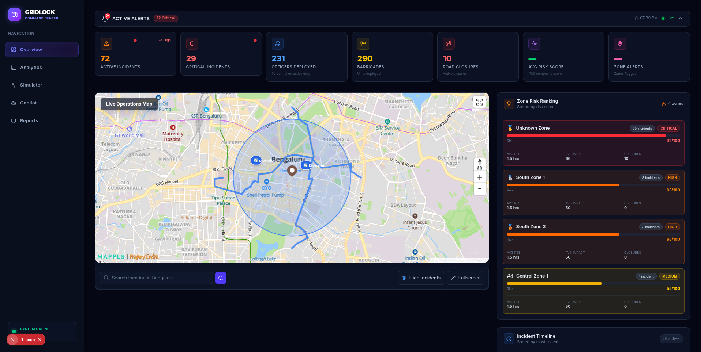
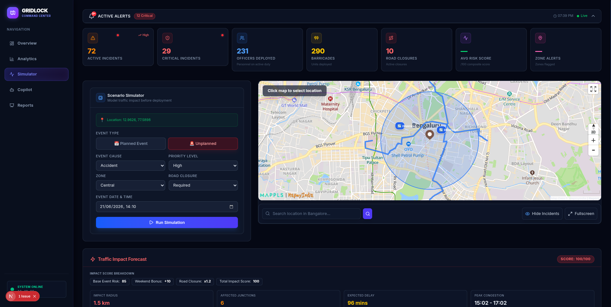
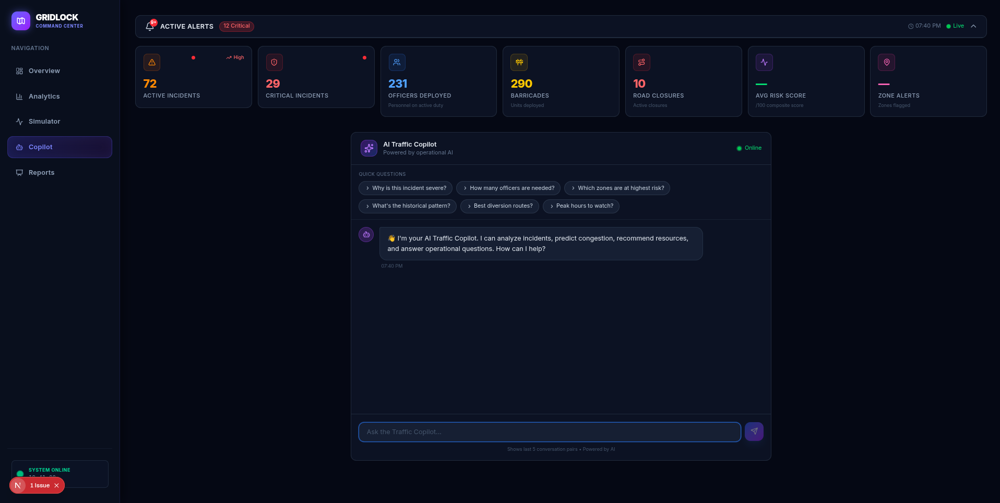
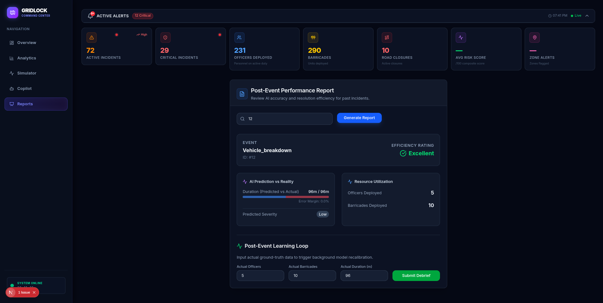
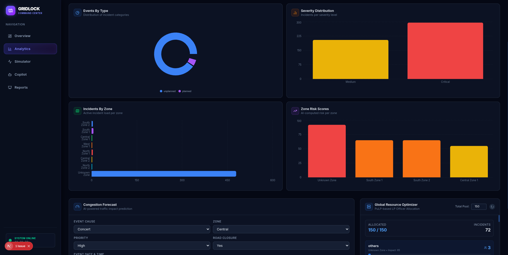
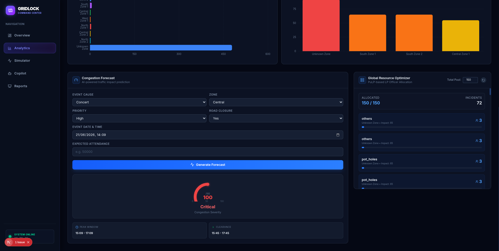

# 🚦 Gridlock AI - Traffic Command Center

Gridlock AI is an enterprise-grade, AI-powered Traffic Operations Platform designed for city authorities and traffic police. It uses Ensemble Machine Learning, real-time telemetry, and LLM-driven OSINT ingestion to forecast congestion, optimize police deployments, and mitigate severe traffic events before they happen.

---

## 🎥 Video Demo & Live Links

- **Full Project Demo (Loom):** [Watch the 5-Minute Demo](https://www.loom.com/share/1807672319e64ed1aad3af08e2f3c92d)
- **Live Frontend Dashboard:** [https://gridlock-olive.vercel.app/](https://gridlock-olive.vercel.app/)

---

## 📸 Screenshots

| Tactical Dashboard Overview | What-If Simulator |
| :---: | :---: |
|  |  |

| AI Traffic Copilot | Live Post-Event Report |
| :---: | :---: |
|  |  |

| Analytics & Data 1 | Analytics & Data 2 |
| :---: | :---: |
|  |  |

---

## ✨ Key Features

### 🧠 Ensemble Machine Learning Forecaster
- **VotingClassifier Ensemble**: Combines the power of `HistGradientBoostingClassifier` and `RandomForestClassifier` for highly accurate severity and impact predictions.
- **Walk-Forward Validation**: Trained using `TimeSeriesSplit` to respect the chronological nature of traffic patterns and prevent data leakage.
- **Haversine Proximity & Spatial Spillovers**: Mathematically calculates the distance to critical PoIs and warns of "Balloon Effects" (displacing traffic into neighboring zones).

### 💥 Compound Conflict Detector (Infrastructure Stress)
- **Geographic Overlap Analysis**: Dynamically queries the database for active **construction** zones. If a new incident overlaps with degraded infrastructure, an **Infrastructure Stress Multiplier** (up to 2.5x) is applied to the risk score.

### 💻 Tactical Command Dashboard (Next.js)
- **Sleek Sidebar Navigation**: A premium, dark-mode administrative UI built with TailwindCSS, Lucide-React, and Glassmorphism design principles.
- **Live Telemetry WebSockets**: Receives high-priority asynchronous alerts directly from the FastAPI backend.
- **What-If Digital Twin**: Run concurrent simulations tweaking attendance multipliers and barricade constraints to see hypothetical congestion outcomes.
- **Self-Learning Loop**: Operators can use the Post-Event Debrief to log actual officer deployments, triggering background recalibration of the ML models.

### 🗺️ Tactical Routing Engine
- **OSMnx & NetworkX Graphs**: Uses real-world street network data of Bengaluru to compute dynamic shortest paths and diversion routes, bypassing active hazard coordinates using Dijkstra's algorithm.

### 🚧 AI Resource Optimizer
- **Linear Programming (PuLP)**: Dynamically balances global police deployments and barricade constraints across concurrent city-wide incidents using constraint-solving algorithms, ensuring maximum mitigation within limited budgets.

### 📈 Anomaly & Surge Detection
- **Statistical Z-Score Engine**: Monitors historical and live event thresholds to detect anomalous traffic volume spikes, triggering early-warning indicators on the dashboard.

---

## 🛠️ Technology Stack

**Frontend:**
- Next.js (v16.2.9) with Turbopack
- React 18 & TypeScript
- TailwindCSS (Premium dark-mode/glassmorphism UI)
- Lucide React Icons

**Backend:**
- Python 3 & FastAPI
- SQLAlchemy (Database ORM)
- Scikit-Learn (ML Training & Inference Pipeline)
- Uvicorn & WebSockets

**AI & LLM:**
- OpenRouter API (GPT-4o-mini) for the AI Copilot and OSINT Harvester

---

## 🚀 Installation & Setup

### 1. Clone the Repository
```bash
git clone https://github.com/Ayushvish2005/gridlock.git
cd gridlock
```

### 2. Backend Setup
```bash
cd backend
# Create a virtual environment
python3 -m venv venv
source venv/bin/activate  # On Windows: venv\Scripts\activate

# Install dependencies
pip install -r requirements.txt
pip install lightgbm catboost  # Optional advanced gradient boosting

# Set up Environment Variables
cp .env.example .env
# Open .env and add your OPENROUTER_API_KEY
```

### 3. Train the ML Models
Before starting the backend, generate the `.pkl` model files:
```bash
# From the root directory (ensure backend venv is active)
python3 train_model.py --data "Astram event data_anonymized.csv"
```

### 4. Start the FastAPI Backend
```bash
cd backend
uvicorn app.main:app --reload --port 8000
```

### 5. Frontend Setup
Open a new terminal window:
```bash
cd frontend

# Install dependencies
npm install

# Start the Next.js development server
npm run dev
```

The Tactical Command Dashboard will now be available at `http://localhost:3000`.

---

## 📚 API Architecture

- `GET /analytics/forecast`: Deterministic mathematical congestion prediction.
- `GET /analytics/zone-risk-ranking`: Aggregates active incidents into prioritized Zone Risk scores.
- `POST /analytics/copilot`: Interactive chat assistant for Traffic Operations protocols.
- `POST /analytics/debrief/{id}`: Logs real-world variances and triggers model recalibration.
- `WS /ws/stream`: Live telemetry broadcast stream for dashboard sirens.
